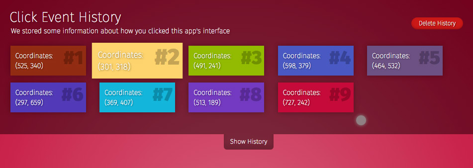

TouchyTouchy was a play around project that involved working with ReactJS, SASS, Browserify and Gulp.

## Installation

```sh
$ npm install
```

This project is not meant for production usage and uses ONLY developement depdencies including del, Gulp, numerous Gulp plugins and http-server.

## Start the Application

```sh
$ npm start -a
```
You can manually start your http-server after installation with the following:
```sh
$ http-server -p -a
```
Where -p is the port # and address is the IP. I personally run this through localhost:8080.

## Commands

Run all build tasks
```sh
$ gulp
```

Build styles
```sh
$ gulp css
```

Compress style image assets
```sh
$ gulp images-css
```

Build javascript
```sh
$ gulp js
```

Compress main image assets
```sh
$ gulp images
```

## Known Issues & TODOs
- There are hardcoded depdencies to my local installation via Homebrew of the SASS gem that is part of the Gulp build scripts. (gulp-ruby-sass plugin)
- The Gulp tasks have poor performance.
- The $ npm start script needs the ability to pass multiple arguments to start the http-server module as needed. You can currently pass only an address, no port. Still reading through the docs.

[Dan DiGangi]:http://dandigangi.me/